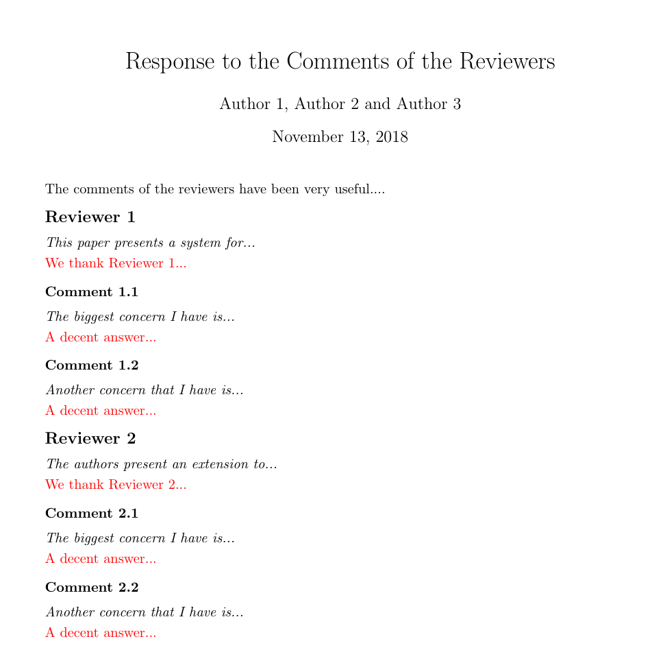

## response-letter-template

This template adds a bunch of commands to help the writing of a response letter for a journal.

<p align="center">
  
</p>


### Usage

To use the new commands:

1. Put the `responseletter.sty` file into the root folder of a latex project.
2. Add `\usepackage{responseletter}` in the preamble of the main file of the project.


### Commands

* `\reviewer{review prologue}{thanks}`

Usually the review of a reviewer starts with a prologue that summarizes the work and its main strenghts and drawbacks.
After this part it is usually good practice to thank the reviewer for her/his feedbacks.

This command creates a title 'Reviewer \<num\>' using the \Large font size and prints *review prologue* in italic and *thanks* in red color.
If thanks is empty it prints 'We thank Reviewer <num>...' as placeholder.

* `\comment{the comment}{answer}`

For each comment provided by a reviewer is good norm to provide a proper answer.
This command prints a title 'Comment \<Reviewer num\>.\<Comment num\>' in bold, it then prints the comment in italic and the answer in red color.

* `\curreviewer`

This command prints the current reviewer name as 'Reviewer \<num\>'

### Example Usage

The example letter depicted in the picture at the beginning of this document is generated by the following code.

```latex

\documentclass{article}
\usepackage{a4wide}
\usepackage{responseletter}

\begin{document}

\title{Response to the Comments of the Reviewers}
\author{Author 1, Author 2 and Author 3}

\maketitle

\noindent The comments of the reviewers have been very useful....

\reviewer{This paper presents a theory and practical system...
}{
	% Thank the reviewer for her/his feedbacks
}

% Tackle each comment with an answer

\comment{The biggest concern I have is...
	% Reviewer comment
}{
	% Your answer
}

\comment{Another concern that I have is... }{}

\reviewer{The authors present an extension to... }{}

\comment{The biggest concern I have is...}{}

\comment{Another concern that I have is...}{}

\end{document}

```
